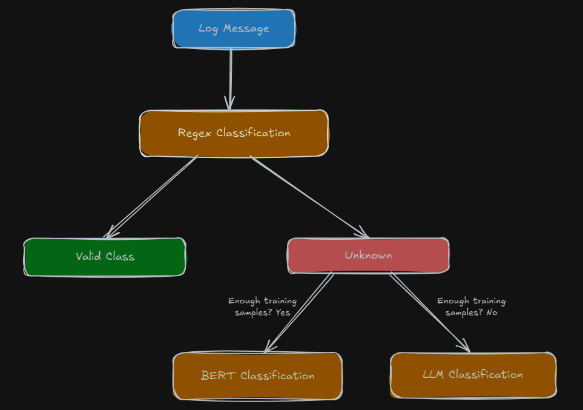

# Log Classification using a Hybrid Classification Framework [Regex, BERT and LLM]

## Overview

This project implements a **hybrid log classification system** that leverages three complementary techniques to effectively handle log patterns of varying complexity — from predictable to complex and sparsely labeled. This approach ensures scalability, adaptability, and high accuracy in real-world log analysis.


## 🚀 Classification Approaches

### 1. Regular Expression (Regex)

* Handles simple and predictable patterns.
* Useful for patterns that can be identified using rule-based logic.
* Example:

  * `User User101 logged in.` ➔ **User Action**

### 2. Sentence Transformer + Logistic Regression

* Manages more complex patterns when sufficient labeled data is available.
* Uses **BERT embeddings** generated by `sentence-transformers`.
* Applies **Logistic Regression** for classification.
* Example:

  * `Payment error: code 503.` ➔ **Transaction Error**

### 3. LLM (Large Language Models)

* Used when labeled training data is sparse or unavailable.
* Acts as a fallback/complementary mechanism.
* Example:

  * `Unexpected shutdown detected.` ➔ **Anomaly**




## 🤖 Tech Stack

| Component    | Technology                         |
| ------------ | ---------------------------------- |
| Embeddings   | BERT (`all-MiniLM-L6-v2`)          |
| ML Model     | Logistic Regression (Scikit-learn) |
| Regex Engine | Python `re` module                 |
| LLM          | DeepSeek R1 or LLaMA               |
| API Layer    | FastAPI                            |

## ⚠️ Problem Statement

### Issues:

* Delays in detecting critical issues
* Operational inefficiencies
* Missed anomalies due to imperfect logging practices

### Why log level-based monitoring isn't perfect:

* Developers often write inconsistent or incomplete log messages

## 📊 Solution

A **log classification and monitoring system** that categorizes logs based on functional meaning, not just severity level. This enhances alerting, analytics, and debugging.

```
aggregated logs ➔ hybrid classification system ➔ log monitoring/dashboard
```
## ✨ Benefits of Hybrid Classification

* Optimized **cost and performance**
* Improved **accuracy**
* **Scalable** across multiple sources and formats

## 📂 Repository Structure

```
Logs Classification System/
├── models/
│   └── log_hybrid_classifier.joblib
├── resources/
│   ├── api_response_snapshot.png
│   ├── flowchart.png
│   ├── input.csv
│   └── output.csv
├── training/
│   ├── dataset/
│   │   └── synthetic_logs.csv
│   └── training.ipynb
├── classify.py
├── processor_bert.py
├── processor_llm.py
├── processor_regex.py
├── server.py
├── requirements.txt
└── README.md
```

## 🚀 Setup Instructions

### 1. Install Dependencies

```bash
pip install -r requirements.txt
```

### 2. Run FastAPI Server

```bash
uvicorn server:app --reload
```

### 3. Access API

* Endpoint: [http://127.0.0.1:8000/classify](http://127.0.0.1:8000/classify)


## ✍️ Usage Instructions

Upload a CSV file containing logs to the FastAPI endpoint for classification.

### Input CSV Columns: 

* `source`
* `log_message`

```
source,log_message
app,User User123 logged out.
legacy,Backup completed successfully.
```

### Output CSV:

* Adds a new column: `target_label`
* Example:

```
source,log_message,target_label
app,User User123 logged out.,User Action
legacy,Backup completed successfully.,System Notification
```

## 🚀 Future Scope

* Add visualization dashboards
* Auto-regex rule generation using NLP pattern mining
* Fine-tuned transformer for domain-specific logs
* Support for real-time log streaming (Kafka integration)


---
